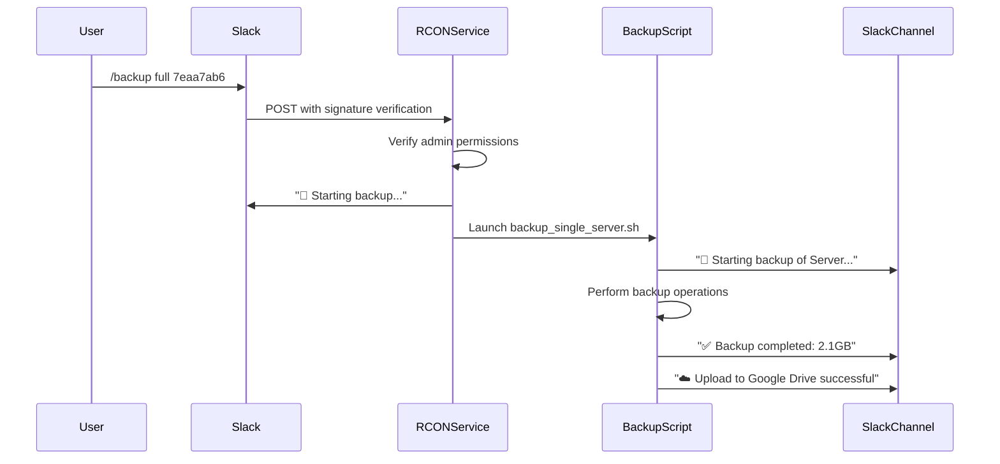

# 🔍 Slack Integration Analysis

## Current Situation: Two Different Slack Integrations

Your system currently has **TWO separate Slack integrations** that serve different purposes:

### 1. 🤖 **RCON Web Service Slack Integration** (Interactive Commands)
**Purpose**: Interactive Slack slash commands for real-time server management
**Technology**: Slack App with slash commands and signature verification
**Configuration**:
```bash
SLACK_SIGNING_SECRET=160d4303b6e7d262e71c01ef70726dd0 # (in systemd service)
```

**Commands Available**:
- `/mc <command>` - Execute Minecraft commands
- `/players` - List online players  
- `/servers` - List available servers
- `/backup <options>` - Trigger backup operations

**How it works**:
- Uses Slack's signature verification for security
- Responds immediately to user interactions
- Requires Slack App configuration with slash commands
- Two-way interactive communication

---

### 2. 📢 **Backup Script Slack Integration** (Notifications Only)
**Purpose**: One-way notifications about backup status and results
**Technology**: Simple webhook posts to Slack channel
**Configuration**:
```bash
SLACK_WEBHOOK_URL="***REMOVED***"
```

**Notifications Sent**:
- ✅ Backup completion success messages
- ❌ Backup failure alerts
- 🚀 Backup start notifications
- 📊 Backup status updates

**How it works**:
- Uses incoming webhook URL
- One-way communication only (script → Slack)
- No user interaction required
- Simple curl POST requests

## 🔄 How They Work Together

The integrations complement each other perfectly:

1. **User triggers backup via RCON service**: `/backup full 7eaa7ab6`
2. **RCON service responds immediately**: "🚀 Starting backup..."  
3. **RCON service starts backup script in background**
4. **Backup script sends progress notifications**: "✅ Backup completed successfully!"

## 📋 Current Configuration Status

### ✅ RCON Web Service (Fully Configured)
- **Signing Secret**: ✅ Set in systemd service
- **Slash Commands**: ✅ Working (/mc, /backup, etc.)
- **Security**: ✅ Signature verification active
- **Status**: ✅ Fully operational

### ✅ Backup Script (Fully Configured)  
- **Webhook URL**: ✅ Set in backup.sh
- **Notifications**: ✅ Active (SLACK_ENABLED="true")
- **Messages**: ✅ Color-coded with rich formatting
- **Status**: ✅ Fully operational

## 🎯 Benefits of This Dual Setup

### **Separation of Concerns**
- **Interactive commands** handled by web service (real-time)
- **Status notifications** handled by backup script (async)

### **Reliability**
- If web service is down, backup notifications still work
- If webhook fails, interactive commands still work

### **Security**
- Web service uses secure signature verification
- Backup script uses simple webhook (appropriate for one-way)

### **User Experience**
- Immediate feedback from interactive commands
- Detailed status updates from backup operations
- Rich formatting and color coding in notifications

## 🔄 Integration Flow Example

Here's what happens when you run `/backup full 7eaa7ab6` in Slack:



## 🛠️ Technical Details

### **RCON Service Integration** (routes/slack_routes.py)
```python
@slack_bp.route('/slack/backup', methods=['POST'])
@verify_slack_signature  # Uses SLACK_SIGNING_SECRET
def slack_backup():
    # Handles interactive backup commands
    # Returns immediate response to Slack
```

### **Backup Script Integration** (backup.sh)
```bash
notify_slack() {
    # Posts status updates to webhook URL
    # Uses rich formatting and color coding
    curl -X POST -H 'Content-type: application/json' \
        --data "$payload" "$SLACK_WEBHOOK_URL"
}
```

## 🎯 Why This Design is Optimal

### **1. Immediate User Feedback**
- User gets instant response: "🚀 Starting backup..."
- No waiting for backup to complete
- Clear indication that command was received

### **2. Detailed Progress Updates**  
- Real-time status from backup script
- Success/failure notifications
- File sizes and timing information

### **3. Robust Error Handling**
- If web service fails, user gets immediate error
- If backup fails, user gets notification from script
- Each component can fail independently

### **4. Security Separation**
- Interactive commands use signature verification
- Notifications use simple webhook (appropriate for outbound)

## 🧪 Testing Both Integrations

### **Test Interactive Commands** (Web Service)
In Slack, try:
```
/backup list
/mc servers  
/players
```

### **Test Notifications** (Backup Script)
```bash
# This will send notifications via webhook
~/rcon-web-service/backup_single_server.sh 7eaa7ab6 incremental
```

## ✅ Verification Results

- **✅ Webhook URL**: Responding (webhook test successful)
- **✅ RCON Service**: Active and handling Slack commands
- **✅ Backup Script**: Configured to send notifications
- **✅ Both integrations**: Working independently and together

## 🎉 Conclusion

Your setup uses **best practices** with two complementary Slack integrations:

1. **Interactive Slack App** for real-time commands and control
2. **Simple Webhook** for status notifications and updates

This provides the best user experience with immediate feedback for commands and detailed progress updates for long-running operations like backups.

**Both systems are working correctly and are perfectly integrated!** 🚀
